

  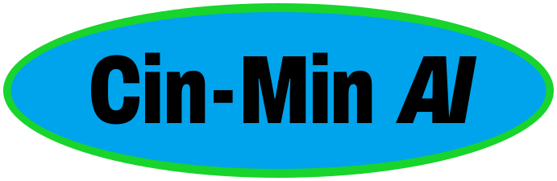

<h1 align="center">Cin-MinAI</h1>

  <b>Linux Mint with an AI assistant built in.</b> 
  It runs on your own computer, on your own graphics card. Nothing you type leaves the machine unless you ask it to. 
  <b>Free. No ads, no telemetry, no account.</b> Download it and use it wherever, however you need it.

  <a href="https://huggingface.co/CinMin/Cin-MinAI-OS"><b>⬇ Download 0.0.1 (Hugging Face)</b></a> ·
  <a href="docs/install/make-usb-stick.md">Make a USB stick</a> ·
  <a href="#what-it-does-today">What it does</a> ·
  <a href="docs/PLAN.md">Every decision</a>

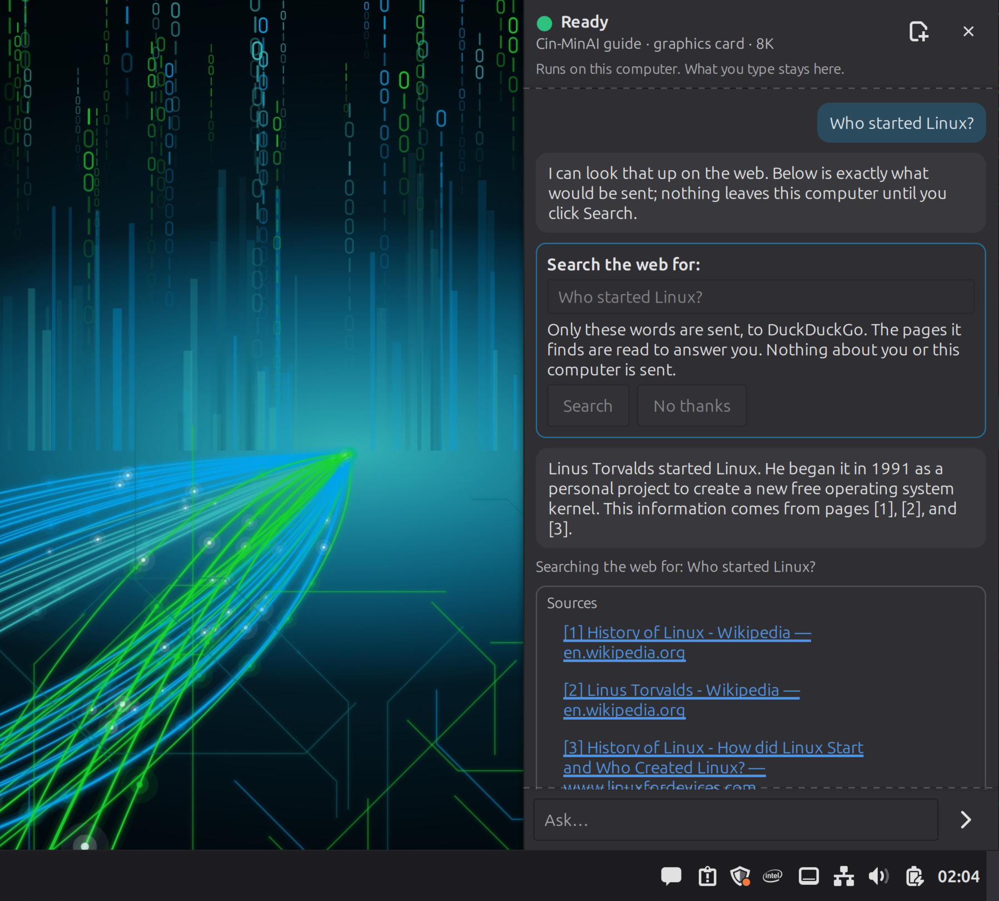 
The guide, on an installed system. Questions about the world go to the web only when you click Search — and it shows exactly what would be sent.

> **Alpha.** It works and it's tested on real hardware, but it's early. Try it from a USB stick first —
> trying it changes nothing on your computer.

## Try it

1. **Download** the ISO from Hugging Face. The page shows its SHA-256, so you can check the file is really ours.
2. **Write it to a USB stick** with balenaEtcher or Rufus, from Windows, no commands —
   [step-by-step guide](docs/install/make-usb-stick.md).
3. **Start your computer from the stick and try it.** The assistant works right away, even with no internet:
   a small model comes on the stick. No picture? See the [hardware notes](docs/hardware.md).
4. **Install it** on a drive when you're ready.
5. **Use it every day** and find out what it's good for. That's the point.

## What it does today

**A guide that's always there.** A sidebar (or press <kbd>Super</kbd>+<kbd>A</kbd>) that answers in plain words,
made for people coming from Windows: *"Where's my C: drive?"*, *"How do I do updates, like Windows Update?"* It
knows Mint's real menu names, gives numbered steps, and opens the right settings page for you. In English, Spanish,
Portuguese, French, German and Japanese.

**It checks your computer and explains what it finds.** *"Is my disk OK? It froze twice today."* — it reads the
system's own records and explains what's wrong and what to do first, without the terminal. (On our test machine
it traced freezes to a kernel that didn't suit an old SSD, and the fix was a click in Update Manager.)

**It builds things with you.** AICUI, the AI workspace: describe a project and it writes it, runs it, checks it,
and shows you every change. On ten-year-old hardware it built a blackjack game you launch with one button and a
wedding web page with RSVP, a menu and a countdown. It asks before it does anything, every time, unless you
tell it otherwise.

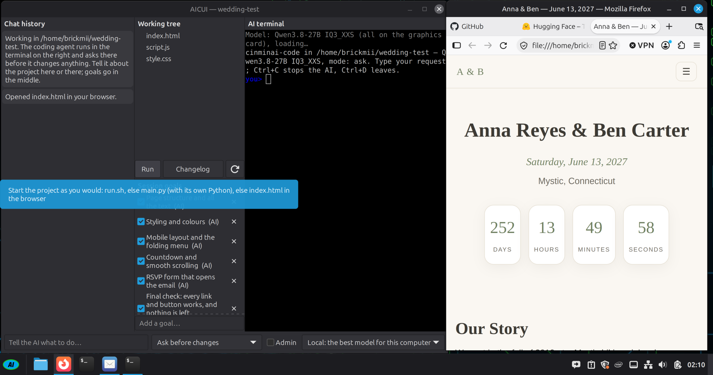

*"Can you add a note on the bottom to bring swimming gear if you are staying for the day?"* — it shows the exact
change and waits for you…

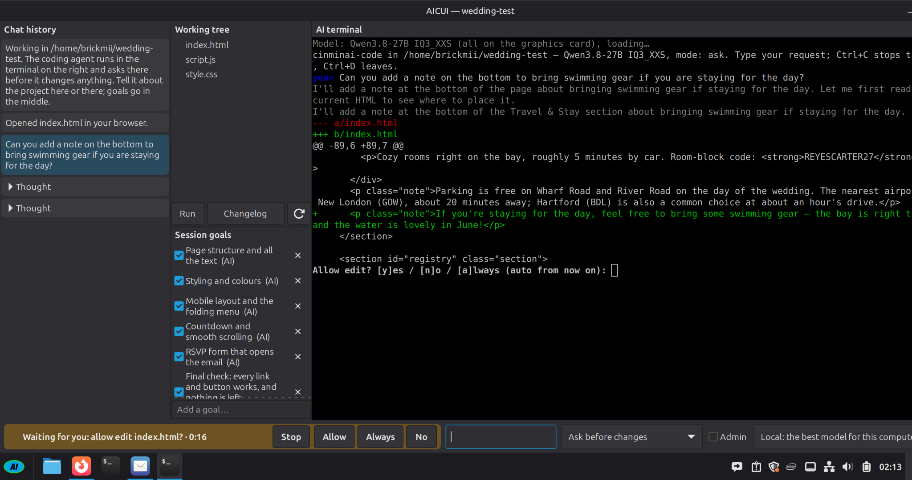

…then makes it, checks it, and tells you where it went:

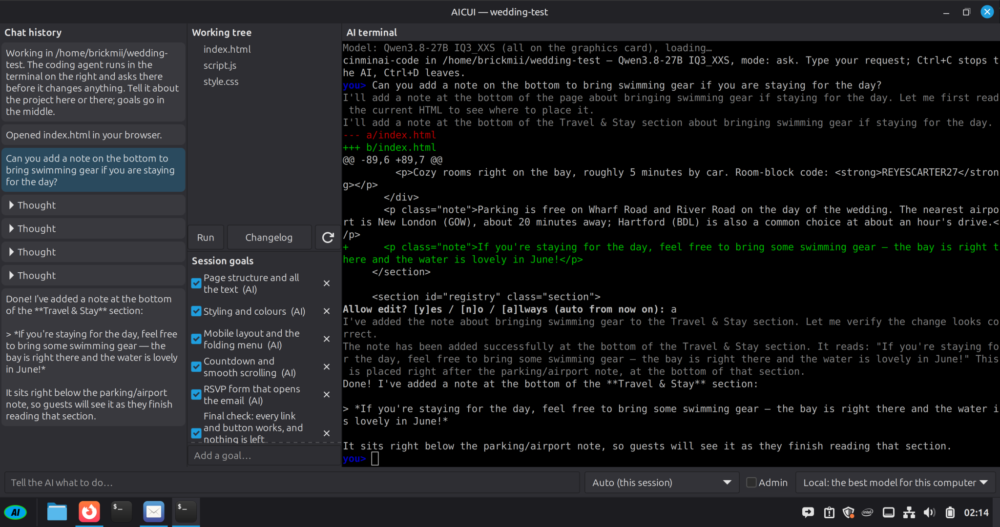 
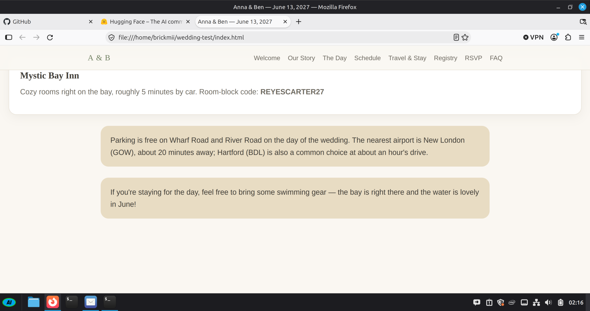

**It teaches as it goes.** Ask it to explain before it fixes: *"Don't fix it yet, tell me what I did wrong."* It
walks through your mistake line by line, waits until you want the fix, then runs your code to prove it works.

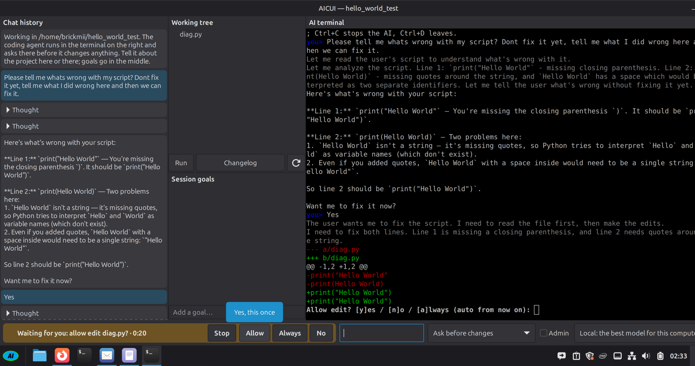 
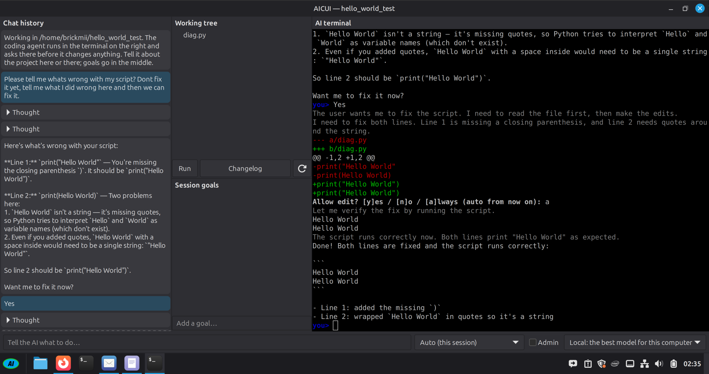

**It can see (update 3).** Watching a YouTube video in Firefox? Ask "summarize this video": it reads the video's transcript and YouTube's preview pictures and tells you what's in it, without the ad breaks and without playing it (the Firefox extension can read youtube.com only, and only when you ask). Show it a photo, a screenshot of an error, a scanned letter or a video file, and it describes it, summarizes it or reads it out. The summary is written on this computer; numbers it read or heard are named so you can check them.

**It writes with you.** A writing space for stories, letters and long projects, and a private journal.

**It works inside LibreOffice.** It edits your document with you — every change previewed, one click to undo.
(Firefox is next.)

**It fits your computer.** It picks the model that runs well on your graphics card and leaves room for your
desktop, and it tells you what it chose and why. Bigger models are an optional download.

**You stay in charge.** The assistant may recommend, explain and prepare an action. It never approves one: anything
that changes your system asks first, and administrator actions ask for your password every time.

**Nothing about you, anywhere.** Cin-MinAI has no ads, no telemetry and no account. Its only connections are the ones
you'd expect: updates (from Linux Mint, Ubuntu and our signed repository), models you choose to download, web
searches you click — and it shows you exactly what a search will send — and, when you ask it to summarize a YouTube
video, that video's preview pictures from YouTube. (Programs like Firefox keep their own
settings, as on any Mint system.)

## What you need

- A 64-bit PC that can run Linux Mint 22 (most PCs from the last ten years), and an 8 GB USB stick to try it.
- For the assistant at full speed: a graphics card with **6 GB** of memory or more — **NVIDIA** (GTX 10-series
  and newer) or **AMD** (through Vulkan; we have no AMD card, so that path is less tested — reports welcome).
  Without one it still works, slowly, on the processor.
- Disk space: what Linux Mint needs (20 GB), plus about 3 GB for the built-in model; more for the optional
  bigger models.
- **[Hardware notes](docs/hardware.md)** — what the assistant can't see when the screen is black: giving the whole
  graphics card to the AI (in the right order!), black screens on NVIDIA cards, kernels and older disks, starting
  from the USB stick.

## How it's made

Cin-MinAI is built **in the open, under the oversight of the people it's for** (PLAN D26). Every decision, result
and failure is written down:

- [docs/PLAN.md](docs/PLAN.md) — the decisions log and the milestones · [docs/SPEC.md](docs/SPEC.md) — the design
- [docs/dev-journal.md](docs/dev-journal.md) — how the work went, day by day
- [docs/guide-model-journal.md](docs/guide-model-journal.md) — how the built-in model was tested, tuned and chosen
- [docs/HELP-WANTED.md](docs/HELP-WANTED.md) — what we can't do alone and would love help with

### From the first boot — phone photos, failures included

| | |
|---|---|
|  | 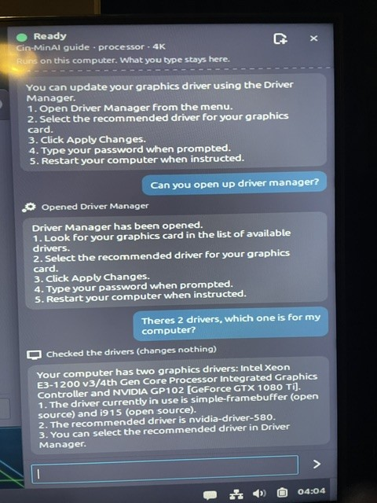 |
| The first live USB (28 Sept): a how-to, a check and a polite no. "17 GB and empty" was true of the USB session's memory and misleading — fixed the next day. | Real hardware: *"There's 2 drivers, which one is for my computer?"* — it opens Driver Manager and checks. |
| 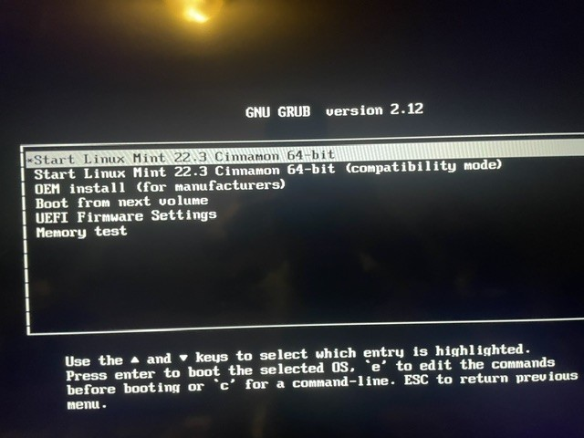 | 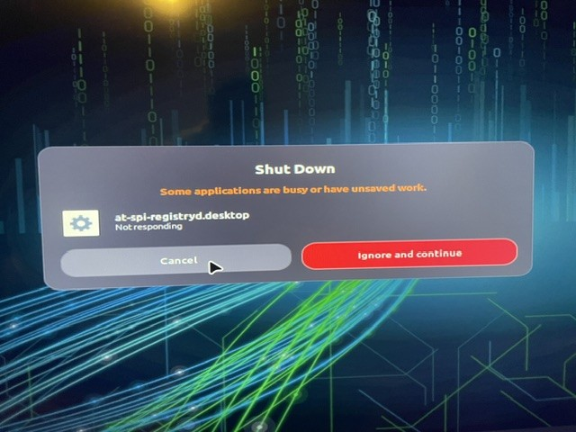 |
| The very first boot menu still said "Linux Mint". | And the first shutdown hung on a program that wasn't responding. Both fixed; [the whole story](docs/dev-journal.md). |

Under the hood: Linux Mint 22.3 Cinnamon (Ubuntu 24.04), llama.cpp for every model, a desktop service on D-Bus that
everything talks to, and signed `.deb` packages from our own apt repository.

## Credits

Cin-MinAI is led by **Ian McClenathan** (Brickmii): vision, decisions, hardware, and every approval.
It is built with AI assistants, each used where it worked best — **none preferred**:

- **Gemini** (Google) — the initial plan.
- **Claude** (Anthropic, via Claude Code) — lead developer: specification and decisions log, the desktop service,
  sidebar, AICUI, packaging and ISO, the evals, the guide model's training tools, write-ups. Commits carry a
  `Co-Authored-By: Claude` line.
- **Codex / ChatGPT** (OpenAI) — junior developer and backup on the test machine: the llama.cpp test build, the
  bakeoff harness (`bench/`), candidate inventory and checksummed downloads, the Vulkan build dependencies. Its
  brief is `AGENTS.md`.

**Standing on the shoulders of others.** Cin-MinAI is a layer on top of decades of other people's work:

- **The Linux Mint team**, for Mint and Cinnamon, the system we build on and keep as Mint-like as we can;
  **Ubuntu (Canonical) and Debian** underneath it; and the **Linux kernel and GNU** communities underneath all of it.
- **llama.cpp and ggml** (Georgi Gerganov and contributors), the engine that runs every model here, tuned to
  each machine.
- **The open-weight model makers**: the **Qwen team** (Alibaba), whose models we tune and ship; Google (Gemma)
  and IBM (Granite), whose models we tested; and **Hugging Face** and the people who publish GGUF conversions
  (Unsloth, ggml-org).
- **LibreOffice (The Document Foundation) and Mozilla**, whose programs the assistant works inside.
- **The researchers and builders who started this era**: from the Transformer paper (Google, 2017) to OpenAI's
  public release of ChatGPT in 2022, which put these tools in everyone's hands and pushed the whole field, open
  models included, forward.

The assistants build the project; they are **not** the source of the guide model's training data. That corpus is
written by local open-weight models (Apache-2.0) and published with its scripts (PLAN D32), so anyone can inspect
or rebuild it.

## Licence

Our code is **GPL-3.0-or-later** (`LICENSE`). Data and documents — the training corpora, eval tasks and docs — are
**CC BY-SA 4.0**; our fine-tuned guide models are **Apache-2.0**, like their base. What covers what, and the
licences of what we build on: [`LICENSING.md`](LICENSING.md). Cin-MinAI is not affiliated with or endorsed by
Linux Mint.
